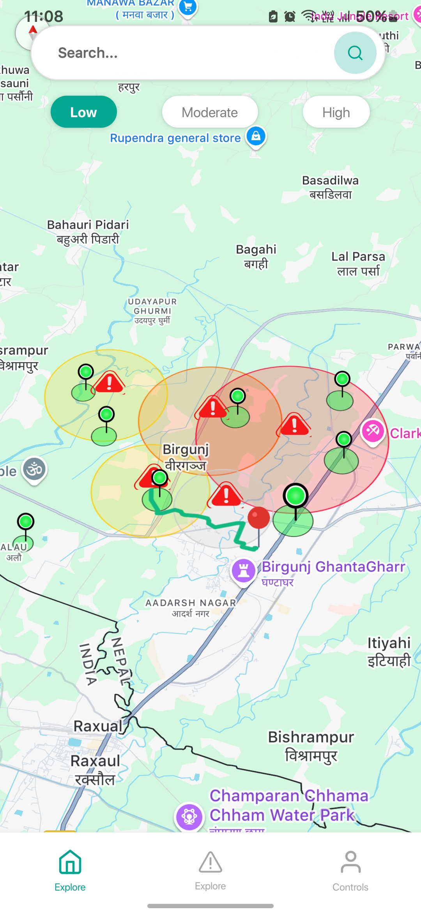
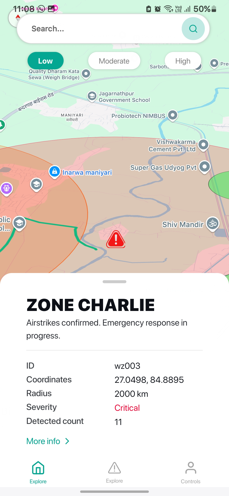
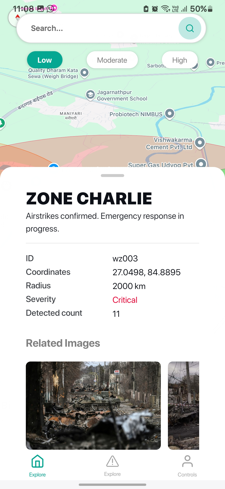
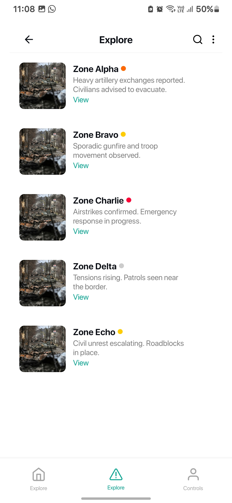
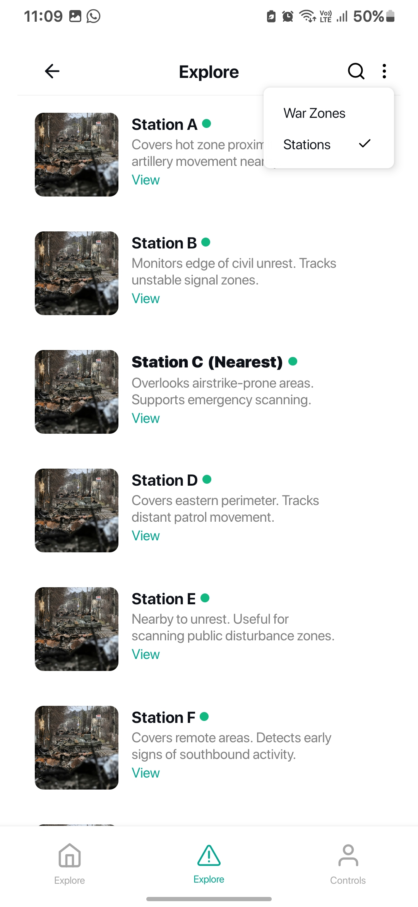
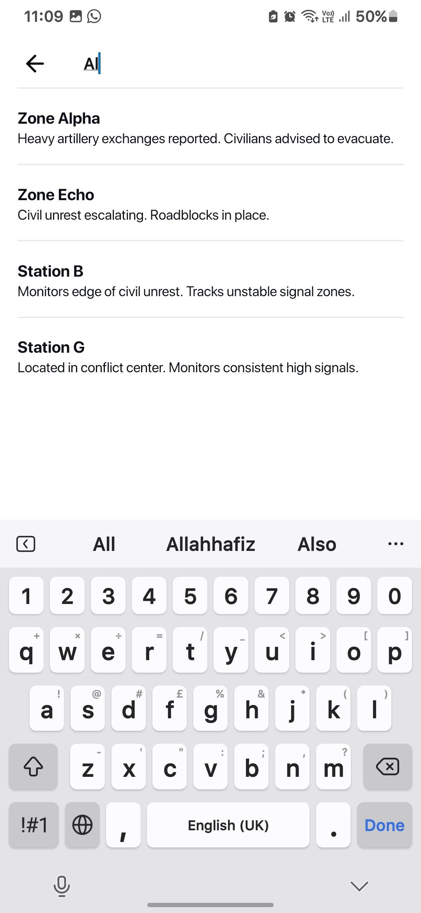
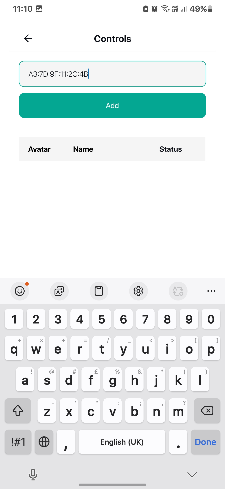
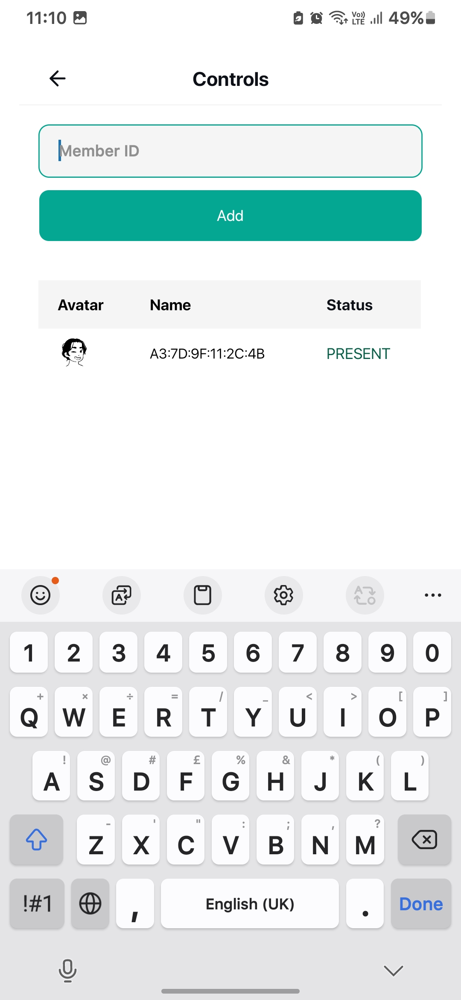
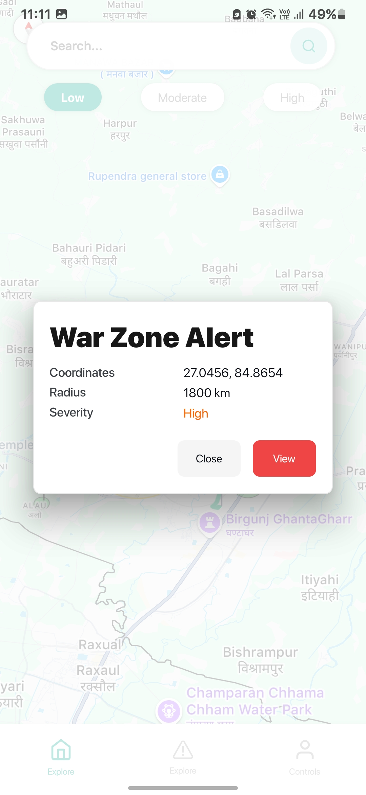
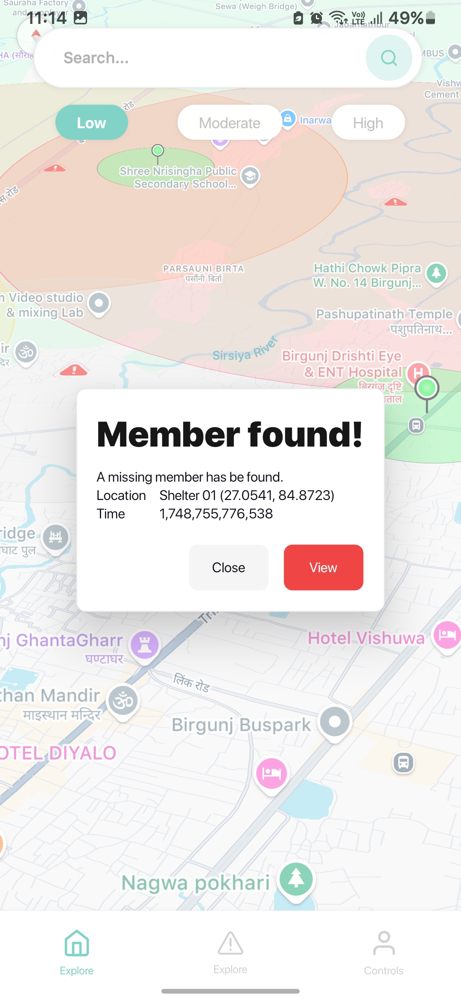

# 🛡️ WarNet

**WarNet** is a tactical ESP32-based surveillance system designed for **war-time safety, monitoring, and rapid response**. By creating a self-contained local network, WarNet provides **real-time AI-driven monitoring** of connected devices and uses intelligent algorithms to detect **potential war zone activity** and **missing individuals**, especially children. The system operates independently of internet connectivity, making it ideal for **disrupted environments** such as disaster or war zones.

---

## 🎯 Purpose

In war-torn areas, internet and mobile networks are unreliable. WarNet uses a **local Wi-Fi network powered by ESP32** to:

- Identify **war zone threats**
- Track **presence of children and civilians**
- Alert nearby **parents or responders** through a local mobile app

---

## 🔐 Key Features

### 🧠 AI War Zone Prediction

- Detects signs of escalating digital or physical conflict (unusual network activity, new unknown devices).
- Uses trained models to classify war zone severity levels: _low_, _moderate_, _high_, _critical_.
- Visualizes nearby threat zones with severity indicators on the app.

### 🧒 Missing Child Detection (via ESP32)

- Registers children's devices in advance.
- If the child's device is **not detected in a safe zone**, the system alerts nearby parents.
- Ideal for **refugee camps**, **shelters**, or **evacuation sites**.

### 🚨 War Zone Alerts on App

- App users receive local alerts.

## ⚙️ Tech Stack

### 🔧 Hardware – ESP32

- Acts as **on-site node** for Wi-Fi hotspot.
- Scans connected devices and monitors MAC address presence.
- Sends logs to backend.

### 📱 Frontend – React Native (Offline-first)

- Interface for civilians, responders, or security personnel.
- Interactive map of **safe zones**, **war zones**, and **last known locations**.
- Pushes and displays alerts offline.

### 🖥️ Backend – Spring Boot

- Central coordinator when infrastructure is available.
- Manages zone data, alerts, user access, and device registration.
- Synchronizes data between nodes (if internet or local servers exist).

### 🧠 AI Engine – Python

- Embedded models for:

  - **War zone severity prediction**
  - **Missing child likelihood detection**

## 🗺️ Deployment Use Cases

| Scenario                | Role of WarNet                                                                     |
| ----------------------- | ---------------------------------------------------------------------------------- |
| **Refugee Camp**        | Track children and family groups within safe perimeter. Alert when someone leaves. |
| **Urban Conflict Zone** | Detect unknown or new devices. Flag as possible threats.                           |
| **Disaster Recovery**   | Locate survivors or registered people through device presence.                     |
| **Military Checkpoint** | Verify civilian movements and known device identities.                             |

---

## 🖼️ Screenshots

 
  
  
    
  
  
    
  
  
    
  

---

## 📦 Future Goals

- 🧠 **TinyML** for on-device AI detection (no server needed)
- 🌐 **Mesh network** between ESP32 units
- 📍 **GPS tracking** and geofencing for safe/unsafe zones

